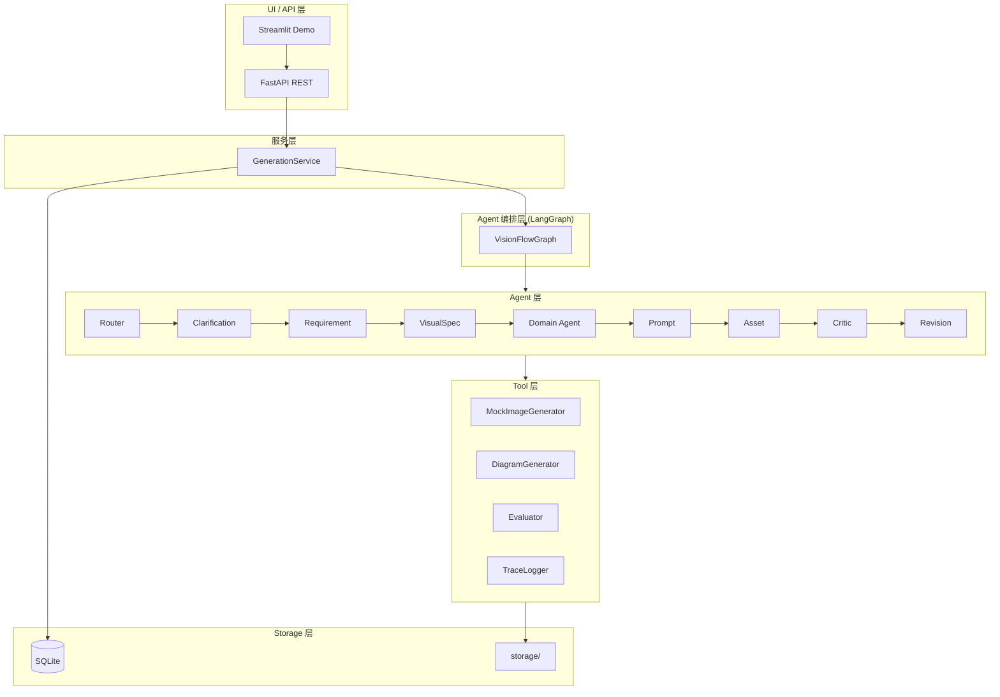
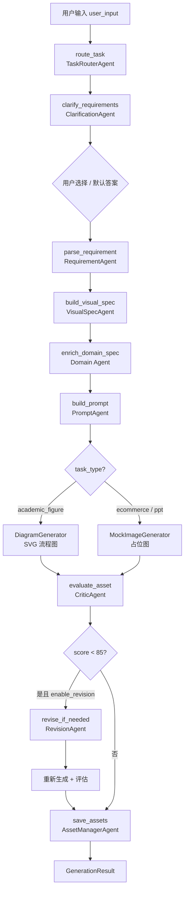

# VisionFlow

**多智能体多领域视觉内容生成系统**

> 企业级应用软件设计与开发 · CS599 · 方向一：Agentic AI 原生开发

---

## 项目简介

VisionFlow 是一个基于多智能体协作（Multi-Agent）的视觉内容生成平台。系统能够根据用户输入的自然语言描述，自动判断任务类型，路由到不同领域 Agent 工作流，生成结构化 **Visual Spec**、**Prompt**、图片或图示、**质量评估报告**和完整的 **Agent Trace**。

## 课程信息

| 项目 | 内容 |
|------|------|
| 课程 | 企业级应用软件设计与开发 |
| 课程编号 | CS599 |
| 项目方向 | 方向一：Agentic AI 原生开发 |
| 项目名称 | VisionFlow |

## 项目背景

现有图片生成工具（如 Midjourney、DALL·E）通常依赖**单次 Prompt**，难以适配不同领域的视觉任务规范：

- 电商图需要促销元素、平台尺寸、广告合规约束
- 论文图示需要清晰的模块关系与学术风格
- PPT 配图需要专业排版与汇报场景适配

**VisionFlow** 使用**多智能体协作**和 **Visual Spec 驱动生成**，将「一次性 Prompt」升级为结构化的跨领域视觉生产流程。

## 核心功能

- **自动任务路由**：Task Router Agent 根据关键词判断 `ecommerce_banner` / `academic_figure` / `ppt_visual`
- **需求澄清**：Clarification Agent 在生成前提出选择题，澄清风格、比例、平台、合规等关键不确定因素
- **需求解析**：Requirement Agent 提取 purpose、主体、风格、受众，并合并澄清答案
- **Visual Spec 生成**：结构化视觉规格，驱动后续生成
- **领域专家增强**：电商 / 学术 / PPT 三套领域规则
- **Prompt / Diagram 生成**：英文图像 Prompt 或 Mermaid 流程图 Spec
- **资产生成**：Mock 占位图（电商/PPT）或 SVG 流程图（学术）
- **质量评估**：Critic Agent 五维评分 + 风险词检测
- **自动修订**：低分时 Revision Agent 自动优化 Prompt
- **完整追溯**：每步 Agent 输出写入 Trace JSON

## Agent 设计

| Agent | 职责 | 输入 | 输出 |
|-------|------|------|------|
| TaskRouterAgent | 任务类型路由 | user_input | task_type, route_reason |
| ClarificationAgent | 需求澄清选择题 | user_input, task_type | ClarificationQuestion[] |
| RequirementAgent | 需求解析 | user_input, clarification | requirement dict |
| VisualSpecAgent | 视觉规格生成 | requirement | VisualSpec |
| EcommerceAgent | 电商领域规则 | VisualSpec | domain_enrichment |
| AcademicFigureAgent | 学术领域规则 | VisualSpec | domain_enrichment |
| PPTVisualAgent | PPT 领域规则 | VisualSpec | domain_enrichment |
| PromptAgent | Prompt 生成 | VisualSpec | prompt / diagram spec |
| AssetManagerAgent | 资产生成与保存 | prompt | output_path |
| CriticAgent | 质量评估 | assets, spec | EvaluationReport |
| RevisionAgent | 自动修订 | evaluation | revised prompt |

## 系统架构



## 工作流程



## 技术栈

| 组件 | 技术 |
|------|------|
| 语言 | Python 3.11+ |
| 后端 API | FastAPI + Uvicorn |
| 前端 Demo | Streamlit |
| Agent 编排 | LangGraph |
| 数据模型 | Pydantic v2 |
| 数据库 | SQLite |
| 图像处理 | Pillow (Mock Provider) |
| 图示生成 | SVG (学术流程图) |
| 测试 | pytest |
| 部署 | Docker / docker-compose |
| 配置 | python-dotenv |

## 安装与运行

### 1. 克隆并安装依赖

```bash
cd cs599-project

# 创建虚拟环境
python -m venv .venv

# Windows
.venv\Scripts\activate

# macOS / Linux
source .venv/bin/activate

pip install -r requirements.txt
copy .env.example .env    # Windows
# cp .env.example .env    # macOS/Linux
```

### 2. 启动 FastAPI 后端

```bash
uvicorn app.main:app --reload --host 0.0.0.0 --port 8000
```

- API 文档：http://localhost:8000/docs
- 健康检查：http://localhost:8000/health

### 3. 启动 Streamlit Demo（新终端）

```bash
streamlit run app/ui/streamlit_app.py
# 或
make ui
```

访问：http://localhost:8501

**Streamlit 两步式交互：**

1. **Step 1**：输入 `user_input` 与 `task_type`，点击「生成澄清问题」
2. **Step 2**：回答 Clarification Agent 返回的选择题（风格、比例、平台等），点击「开始生成」
3. **Step 3**：查看路由结果、澄清答案、Visual Spec、Prompt、图片/SVG、评估报告与 Agent Trace

**Demo Day 答辩**：参见 [docs/demo/demo_script.md](docs/demo/demo_script.md)

### 4. Makefile 快捷命令

```bash
make install     # 安装依赖
make api         # 启动 FastAPI
make ui          # 启动 Streamlit
make test        # 运行 pytest
make benchmark   # 运行三案例 Benchmark，输出 storage/reports/benchmark_report.json
make lint        # ruff 检查（需 pip install ruff）
make format      # black 格式化（需 pip install black）
```

Windows 需安装 [Make](https://gnuwin32.sourceforge.net/packages/make.htm) 或 Git Bash；也可直接运行等价命令：

```bash
python -m pytest tests/ -v
python -m app.tools.benchmark
```

### 5. Docker 部署（可选）

```bash
docker-compose up --build
```

## API 说明

### GET /health

```json
{"status": "ok"}
```

### POST /clarify

在生成前获取澄清选择题。前端先调用此接口，展示选项后再调用 `/generate`。

**请求：**

```json
{
  "user_input": "为一款夏季低糖冰咖啡生成一张小红书风格促销图",
  "task_type": "auto"
}
```

**响应：** `ClarificationResponse`（含 `task_type`、`route_reason`、`questions`）

**选择题示例（ecommerce_banner）：**

| question_id | 问题 | 默认选项 |
|-------------|------|----------|
| platform | 目标投放平台 | xiaohongshu |
| marketing_goal | 营销目标 | product_focus |
| style | 整体视觉风格 | professional_minimal |
| aspect_ratio | 图片比例 | 16:9 |
| promotion_intensity | 促销强度 | light |
| compliance_level | 合规策略 | standard |

### POST /generate

**请求：**

```json
{
  "user_input": "为一款夏季低糖冰咖啡生成一张小红书风格促销图",
  "task_type": "auto",
  "style_preference": "小红书风格",
  "target_audience": "年轻消费者",
  "aspect_ratio": "1:1",
  "enable_revision": true,
  "clarification_answers": [
    {"question_id": "style", "selected_value": "fresh_natural"},
    {"question_id": "aspect_ratio", "selected_value": "1:1"},
    {"question_id": "compliance_level", "selected_value": "conservative"}
  ],
  "skip_clarification": false
}
```

若 `skip_clarification=false` 且 `clarification_answers` 为空，系统自动使用各题的 `default_value` 继续生成，不会报错。

**响应：** `GenerationResult`（含 task_id、visual_spec、prompt、output_path、evaluation、traces、clarification_answers）

### GET /tasks

返回任务摘要列表。

### GET /tasks/{task_id}

返回单个任务完整 `GenerationResult`。

## 示例输入输出

| 领域 | 输入示例 | 输出类型 |
|------|----------|----------|
| 电商 | `为夏季低糖冰咖啡生成小红书风格促销图` | PNG 占位图 |
| 学术 | `生成论文方法流程图：预处理→特征提取→分类` | SVG 流程图 |
| PPT | `为课程汇报生成专业科技感封面配图` | PNG 占位图 |

示例 JSON 见 `examples/` 目录。

## 测试方式

```bash
make test
# 或
pytest tests/ -v
```

测试覆盖：路由 Agent、Visual Spec、评估器、三示例完整生成流程、LLM fallback、Benchmark。

### Benchmark

```bash
make benchmark
```

自动运行 `examples/` 下三个案例，输出指标并保存至 `storage/reports/benchmark_report.json`。

Streamlit 侧边栏也可点击 **Run Benchmark** 按钮运行并展示结果。

### Demo 可观测性

Streamlit 生成结果页包含 **Agent Trace Timeline**：
- 按执行顺序展示每个 Agent
- 表格 + 展开卡片显示 input/output/metadata
- `duration_ms` 逐步耗时与总耗时

## 项目目录结构

```
cs599-project/
├── app/
│   ├── main.py                 # FastAPI 入口
│   ├── config.py               # 环境配置
│   ├── agents/                 # 10 个 Agent 模块
│   ├── llm/                    # 可选 LLM Provider（mock/openai/deepseek）
│   ├── graph/                  # LangGraph 工作流
│   ├── tools/                  # 图像/图示/评估/存储工具
│   ├── models/                 # Pydantic Schema + SQLite
│   ├── services/               # GenerationService
│   └── ui/                     # Streamlit Demo
├── docs/
│   ├── specs/                  # 6 份规格文档
│   ├── images/                 # Mermaid 架构图源文件 (.mmd)
│   ├── demo/                   # Demo Day 展示脚本
│   └── report_outline.md       # CS599 报告大纲
├── examples/                   # 三领域示例 JSON
├── storage/                    # 生成资产（图片/prompt/report/trace）
├── tests/                      # pytest 测试
├── requirements.txt
├── pyproject.toml              # black / ruff / pytest 配置
├── Makefile
├── docker-compose.yml
└── README.md
```

## 环境变量

参见 `.env.example`。关键配置：

| 变量 | 说明 | 默认 |
|------|------|------|
| `LLM_PROVIDER` | LLM 提供商：`mock` / `openai` / `deepseek` | `mock` |
| `OPENAI_API_KEY` | OpenAI API 密钥（可选） | 空 |
| `DEEPSEEK_API_KEY` | DeepSeek API 密钥（可选） | 空 |
| `OPENAI_MODEL` | OpenAI 模型名 | `gpt-4o-mini` |
| `DEEPSEEK_MODEL` | DeepSeek 模型名 | `deepseek-chat` |
| `IMAGE_PROVIDER` | 图像提供商 | `mock` |

## LLM 配置说明

VisionFlow 支持可选 LLM 增强，**默认 `LLM_PROVIDER=mock` 使用规则模板，无需 API Key 即可完整运行**。

### 模式说明

| LLM_PROVIDER | 行为 |
|--------------|------|
| `mock`（默认） | 纯规则 + 模板模式，不调用外部 API |
| `openai` | 尝试 OpenAI API；无 Key 或调用失败时自动 fallback 到规则模式 |
| `deepseek` | 尝试 DeepSeek API；无 Key 或调用失败时自动 fallback 到规则模式 |

### 启用 OpenAI

```env
LLM_PROVIDER=openai
OPENAI_API_KEY=sk-your-key-here
OPENAI_MODEL=gpt-4o-mini
```

### 启用 DeepSeek

```env
LLM_PROVIDER=deepseek
DEEPSEEK_API_KEY=your-deepseek-key
DEEPSEEK_MODEL=deepseek-chat
```

### LLM 增强的 Agent

- `RequirementAgent`、`VisualSpecAgent`、`PromptAgent`、`CriticAgent`、`RevisionAgent`

Trace 中记录：`llm_requested_provider`、`llm_actual_provider`、`llm_fallback`、`llm_parse_ok`

### LLM 模块结构

```
app/llm/
├── base.py          # BaseLLM 抽象接口
├── mock_llm.py      # 稳定模板 Mock 实现
├── openai_llm.py    # OpenAI（httpx，无需 openai SDK）
├── deepseek_llm.py  # DeepSeek（OpenAI 兼容 API）
└── llm_factory.py   # 工厂 + 自动 fallback
```

统一接口：`generate_text(system_prompt: str, user_prompt: str) -> str`

## 学术诚信说明

- **不硬编码 API Key**：所有密钥通过 `.env` 环境变量配置，`.env` 已加入 `.gitignore`
- **开源依赖**：本项目使用 FastAPI、LangGraph、Streamlit、Pillow 等开源库，详见 `requirements.txt` 和 `LICENSE`
- **外部模型接入**：在 `.env` 中配置 `LLM_PROVIDER=openai` 或 `deepseek` 并填入对应 API Key；默认 `mock` 模式无需外部 API
- **Mock 图像生成**：Demo 阶段使用 PIL 生成占位图，学术图示使用 SVG，不依赖付费图像 API

## License

MIT
