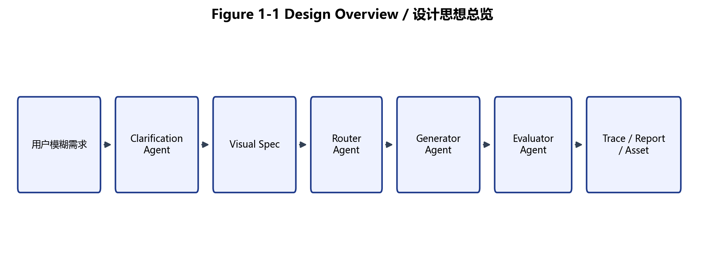
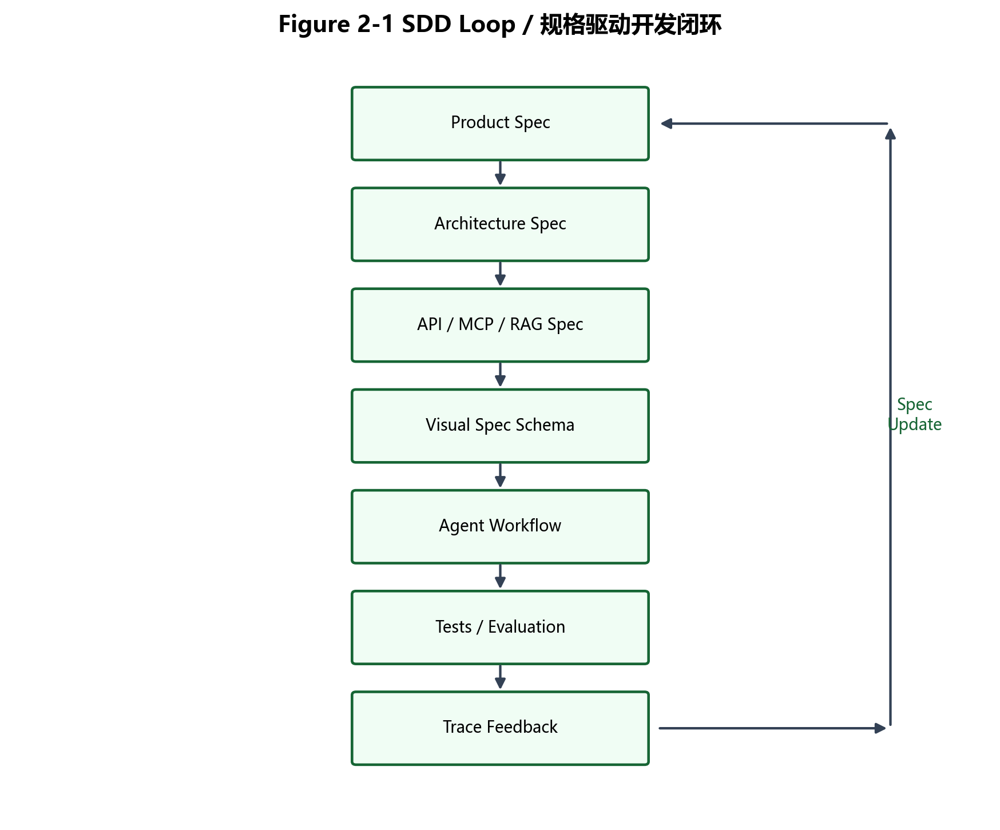
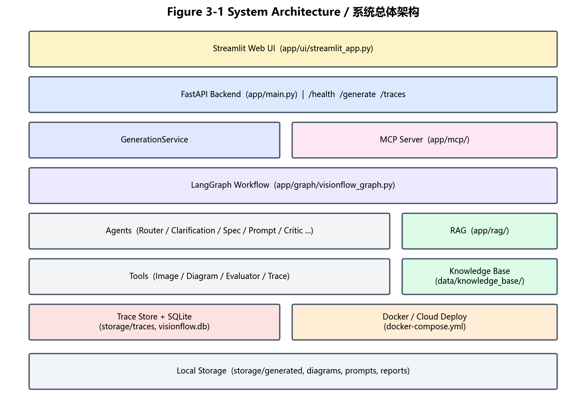
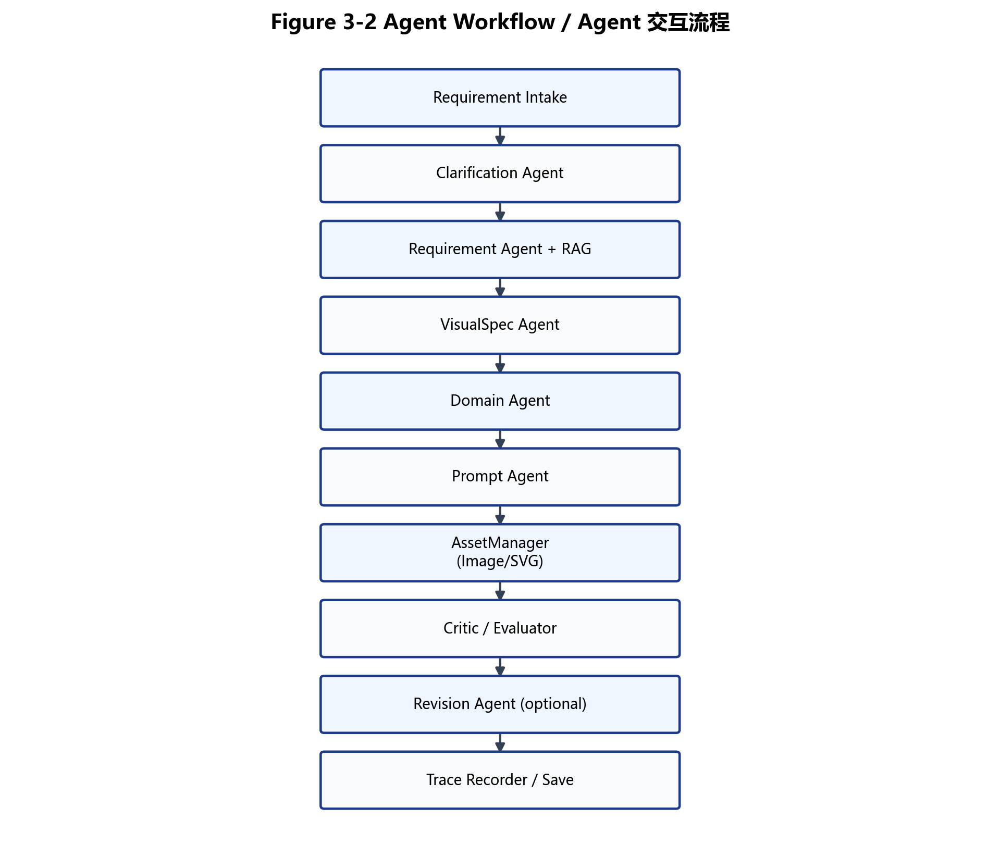
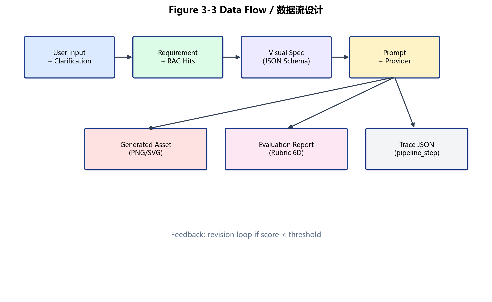
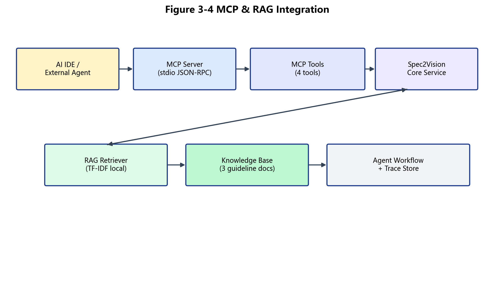
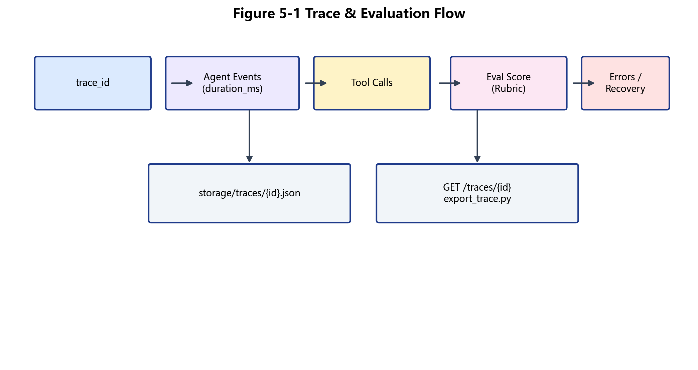
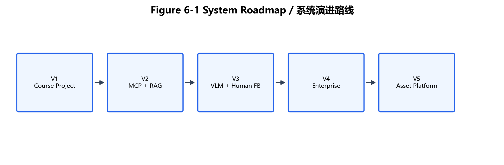

<!-- STUDENT_INFO_BEGIN -->

# Spec2Vision：Visual Spec 驱动的多 Agent 视觉资产生成系统

## CS599 期末大作业报告

| 字段 | 内容 |
|---|---|
| 课程名称 | 企业级应用软件设计与开发 |
| 课程代码 | 50120224001 / CS599 |
| 项目名称 | Spec2Vision：Visual Spec 驱动的多 Agent 视觉资产生成系统 |
| 方向 | 方向一：Agentic AI 原生开发 |
| 学号 | 请填写学号 |
| 姓名 | 请填写姓名 |
| 专业 | 请填写专业 |
| 指导教师 | 戚欣 |
| 提交日期 | 2026 年 6 月 22 日 |
| GitHub 仓库 | https://github.com/skywalker767/Spec2Vision |
| 在线 Demo | 待部署：请在部署后替换为真实公网 URL |

\newpage

<!-- STUDENT_INFO_END -->

# 摘要

Spec2Vision 是一个 **Visual Spec 驱动的多 Agent 视觉资产生成系统**，面向电商主图、学术图表与 PPT 封面三类场景。系统通过 Clarification Agent 消歧、Visual Spec Agent 规格化、LangGraph 编排的多 Agent 流水线完成生成，并以启发式 Rubric Evaluator 与全链路 Trace 形成可审计闭环。

本项目已实现：**FastAPI + Streamlit 双端**、**Mock 默认可离线运行**（147 项 pytest 通过）、**MCP stdio Tool Server（4 工具）**、**Agentic RAG（本地 TF-IDF 知识库）**、**Docker Compose 部署**、**结构化错误处理与安全校验**。在线公网 Demo URL 尚未部署，文档中标注为待填写。

**关键词：** Visual Spec · Multi-Agent · LangGraph · MCP · Agentic RAG · Evaluation · Trace

---

- [第一章 选题背景与设计思想](#第一章-选题背景与设计思想)
- [第二章 Specs 规格文档](#第二章-specs-规格文档)
- [第三章 系统架构与设计](#第三章-系统架构与设计)
- [第四章 关键实现与代码展示](#第四章-关键实现与代码展示)
- [第五章 测试与评估](#第五章-测试与评估)
- [第六章 系统升级与扩展](#第六章-系统升级与扩展)
- [第七章 课程总结](#第七章-课程总结)
- [参考文献与开源引用](#参考文献与开源引用)
- [附录 A：运行与部署指南](#附录-a运行与部署指南)
- [附录 B：评分点对照表](#附录-b评分点对照表)
- [附录 C：Demo Day 演示脚本](#附录-cdemo-day-演示脚本)

---

# 第一章 选题背景与设计思想

## 1.1 问题背景

传统 Text-to-Image 系统依赖**一次性 Prompt**，存在四类工程问题：

1. **Prompt 模糊**：用户自然语言难以表达布局、比例、合规约束；
2. **需求不可追踪**：生成过程缺乏结构化中间产物；
3. **结果不可复现**：同一 Prompt 难以稳定复现资产与评估；
4. **质量难评估**：缺少与需求对齐的可解释评分。

在企业级视觉资产生产中，上述问题导致沟通成本高、风格一致性差、审核无法量化。因此需要从 **Prompt Engineering** 升级到 **Visual Spec Driven Development（SDD）**：先规格、再生成、再评估、再 Trace。

## 1.2 项目目标

| 目标 | 实现路径 |
|------|----------|
| 模糊需求 → 结构化 Visual Spec | Clarification + VisualSpecAgent |
| 多场景自适应 | RouterAgent 三分类 + Domain Agent |
| 可复现生成 | Mock/Real Provider + 固定 Workflow |
| 可审计闭环 | Evaluator Rubric + Trace JSON |

## 1.3 项目价值

- **对用户**：降低专业设计门槛，支持澄清式交互；
- **对企业**：提升可控性、可复现性与合规审计能力；
- **对课程**：体现从「代码编写者」到「智能体编排者」的转变。

## 1.4 技术路线

- SDD 规格驱动 · LangGraph 状态编排 · Multi-Agent 协作  
- Tool Use（Image / Diagram / Evaluator）· MCP Server · Agentic RAG  
- Evaluation + Trace · Docker · CI · Security & Observability  



*图 1-1 设计思想总览图*

---

# 第二章 Specs 规格文档

本章基于 `docs/specs/` 目录六份核心规格及 MCP/RAG 扩展规格整理。

## 2.1 Product Spec（`docs/specs/product_spec.md`）

**目标用户：** 电商运营、研究人员、汇报场景用户。

**核心场景：** 电商主图（`ecommerce_banner`）、学术图表（`academic_figure`）、PPT 视觉（`ppt_visual`）。

**非功能需求：** Mock 离线可运行、Trace 可导出、无 Key 可测试。

**验收标准：** `pytest` 全绿、`benchmark.py --demo` 可复现、`examples/demo/` 工件完整。

## 2.2 Architecture Spec（`docs/specs/architecture_spec.md`）

| 层级 | 模块 | 路径 |
|------|------|------|
| 前端 | Streamlit UI | `app/ui/` |
| API | FastAPI | `app/main.py` |
| Service | GenerationService | `app/services/` |
| Agent | LangGraph + 10 Agents | `app/agents/`, `app/graph/` |
| Tool | Image / Evaluator / Trace | `app/tools/` |
| RAG | TF-IDF Retriever | `app/rag/` |
| MCP | stdio Tool Server | `app/mcp/` |
| Storage | SQLite + JSON Trace | `storage/` |

## 2.3 API Spec（`docs/specs/api_spec.md` + 实现）

| 方法 | 路径 | 说明 |
|------|------|------|
| GET | `/health` | 深度健康检查（DB/Storage/RAG） |
| POST | `/generate` | 完整生成流水线 |
| POST | `/clarify` | 澄清选择题 |
| GET | `/traces/{trace_id}` | 结构化 Trace 查询 |
| GET | `/tasks/{task_id}` | 任务详情 |

**统一成功响应（新端点）：**

```json
{"success": true, "data": {...}, "trace_id": "abc12345"}
```

**统一错误响应：**

```json
{"success": false, "error": {"code": "validation_error", "message": "...", "recoverable": true}, "trace_id": "..."}
```

## 2.4 Visual Spec Schema（`docs/specs/visual_spec.md`）

核心字段：`task_type`, `title`, `aspect_ratio`, `key_elements`, `constraints`, `output_format`, `evaluation_dimensions`，及领域扩展 `product_poster` / `academic` / `educational`。

## 2.5 MCP Spec（`docs/specs/mcp_spec.md`）

| Tool | 功能 |
|------|------|
| `create_visual_spec` | 需求 → Visual Spec JSON |
| `generate_visual_asset` | 完整生成流水线 |
| `evaluate_visual_asset` | Rubric 评估 |
| `query_generation_trace` | Trace 查询 |

## 2.6 RAG Spec（`docs/specs/rag_spec.md`）

- **知识库：** `data/knowledge_base/*.md`（电商/学术/PPT 规范）
- **索引：** 本地 TF-IDF（`scripts/ingest_knowledge_base.py`）
- **Agent 使用：** `RequirementAgent._apply_rag()` 注入 constraints
- **Trace：** `pipeline_step=rag_retrieval`

## 2.7 规格可执行性

Spec 不仅存在于文档，更被 **Pydantic Schema、Agent Workflow、pytest、MCP Tools、Demo 工件** 共同验证。



*图 2-1 规格驱动开发闭环图*

---

# 第三章 系统架构与设计

## 3.1 总体架构

系统采用分层架构：UI → API → Service → LangGraph → Agents → Tools → Storage，并横向集成 MCP 与 RAG。



*图 3-1 系统总体架构图*

## 3.2 Agent 交互流程

LangGraph 定义 10+ 节点，含条件修订分支；每步记录 `duration_ms` 与 `pipeline_step`。



*图 3-2 Agent 交互流程图*

## 3.3 数据流设计

用户输入经 Requirement + RAG 变为 Visual Spec，驱动 Prompt 与资产生成；评估结果与 Trace 持久化至 `storage/`。



*图 3-3 数据流设计图*

## 3.4 MCP 与 Agentic RAG 集成

外部 Agent 客户端通过 MCP stdio 调用核心服务；RAG 检索结果进入 Requirement 约束与 Trace。



*图 3-4 MCP 与 Agentic RAG 集成图*

**设计要点：**

- 状态管理：LangGraph `WorkflowState`，非简单函数链；
- RAG：为规格生成提供规范约束，非普通 QA；
- MCP：系统可作为外部 Agent 工具；
- Trace：全链路可观测、可答辩展示；
- Docker：`docker compose up --build` 可复现部署。

---

# 第四章 关键实现与代码展示

## 4.1 LangGraph Workflow

```python
# app/graph/visionflow_graph.py（节选）
def _timed_call(state, fn):
    start = time.perf_counter()
    state = fn(state)
    duration_ms = int((time.perf_counter() - start) * 1000)
    if state.traces:
        state.traces[-1] = state.traces[-1].model_copy(update={"duration_ms": duration_ms})
    state.traces = list(state.traces)  # 强制 LangGraph 传播
    return state
```

节点链：`route_task → clarify → parse_requirement → build_visual_spec → enrich_domain → build_prompt → generate_asset → evaluate → [revise] → save_assets`。

## 4.2 Visual Spec 构造

`VisualSpecAgent.build()` 合并用户输入、澄清答案、RAG constraints 与领域默认值，输出 Pydantic `VisualSpec`（`app/agents/visual_spec_agent.py`）。

## 4.3 MCP Tool 定义

```python
# app/mcp/tools.py（节选）
def create_visual_spec(payload: dict) -> McpToolResult:
    req = CreateVisualSpecInput.model_validate(payload)
    user_input = validate_user_input(req.user_input)
    state = WorkflowState(request=gen_req, task_id=task_id)
    state = router.route(state)
    state = requirement.parse(state)  # 含 RAG
    state = visual.build(state)
    return _ok({"visual_spec": state.visual_spec.model_dump(), ...})
```

## 4.4 Agentic RAG 检索

```python
# app/rag/retriever.py（节选）
def build_context(self, query, *, task_type=None, top_k=3) -> RagContext:
    hits = self.search(query, task_type=task_type, top_k=top_k)
    # domain_defaults + snippet 规则 → applied_constraints
    return RagContext(query=query, hits=hits, applied_constraints=uniq)
```

## 4.5 Evaluation Rubric

`app/tools/evaluator.py` 实现六维 Rubric：`visual_validity`, `spec_completeness`, `requirement_alignment`, `domain_fit`, `traceability`, `reproducibility`。为**启发式评估**，非 VLM 审美模型。

## 4.6 Trace 记录

```python
# app/tools/trace_logger.py（节选）
append_trace(..., metadata={..., "pipeline_step": "rag_retrieval"}, pipeline_step="rag_retrieval")
# 持久化：storage/traces/{task_id}.json
```

## 4.7 配置与安全

- 配置：`app/config.py`（Pydantic Settings，`.env` 读取）
- 安全：`app/core/security.py`（输入长度、路径 traversal、上传白名单）
- 错误：`app/core/errors.py`（`AppError` 结构化响应）

## 4.8 Mock / Real Provider

| 模式 | 环境变量 | 用途 |
|------|----------|------|
| Mock | 默认 `.env.example` | 离线测试/答辩 |
| Real | `IMAGE_PROVIDER=openai` + Key | 真实图像生成 |

## 4.9 AI IDE 辅助开发

本项目使用 AI IDE（Cursor）辅助：需求拆解、规格撰写、代码重构、测试补全、文档生成。

> **图 4-1：AI IDE 辅助开发截图** — 最终提交前请替换为真实截图。

---

# 第五章 测试与评估

## 5.1 测试目标

功能正确性 · Agent 稳定性 · RAG 有效性 · MCP 可调用 · Trace 可追溯 · 安全合规。

## 5.2 测试类型与命令

| 类型 | 命令 |
|------|------|
| 全量单元/集成 | `python -m pytest tests/ -v` |
| RAG | `pytest tests/test_rag_*.py` |
| MCP | `pytest tests/test_mcp_tools.py` |
| 安全 | `pytest tests/test_security_paths.py` |
| Smoke | `python scripts/smoke_test.py` |
| Docker | `docker compose up --build` |

## 5.3 测试结果（真实运行，2026-06-17）

| 指标 | 结果 |
|------|------|
| pytest | **147 passed, 1 skipped** |
| 环境 | Mock LLM + Mock Image，无 API Key |
| CI | `.github/workflows/test.yml` + `ci.yml` |

## 5.4 Demo 案例

| 案例 | 路径 | 类型 |
|------|------|------|
| 电商主图 | `examples/demo/ecommerce/` | Mock PNG |
| 学术图表 | `examples/demo/academic/` | SVG/PNG |
| PPT 封面 | `examples/demo/ppt/` | Mock PNG |

## 5.5 Benchmark Smoke

`benchmarks/examples.jsonl` 12 用例，`routing_accuracy >= 0.75`（`tests/test_benchmark.py`）。属回归套件，非严谨 ML benchmark。

## 5.6 Trace / Evaluation 数据流



*图 5-1 Trace 与评估数据流图*

## 5.7 局限性（诚实说明）

1. Mock 模式不能代表真实图像审美；
2. Heuristic Evaluation 不能替代人工或 VLM Judge；
3. 真实 API 依赖外部服务稳定性；
4. 多租户、权限、计费尚未实现；
5. **公网 Demo URL 待部署**（见 README TODO）。

---

# 第六章 系统升级与扩展

## 6.1 V1 当前版本

Visual Spec · Multi-Agent · Mock/Real · Evaluation · Trace · Docker · CI · MCP · RAG

## 6.2 V2–V5 路线图

详见 `docs/roadmap.md`。



*图 6-1 系统演进路线图*

---

# 第七章 课程总结

## 7.1 从代码编写者到智能体编排者

开发重心从「写一个函数」转向「定义规格、状态、工具、评估与约束」。LangGraph 让 Agent 行为可组合、可追踪。

## 7.2 对 SDD 的理解

Visual Spec 将模糊语言变为可验证契约，减少生成漂移；规格变更可回流测试与 Trace。

## 7.3 对 Agentic AI 工程的理解

难点在于：任务分解、状态管理、工具选择、错误恢复、可观测性、评估闭环——而非单次 LLM 调用。

## 7.4 对企业级软件的理解

企业级 AI 应用需：**可部署、可测试、可追踪、可扩展、可安全运行**。

## 7.5 个人收获

- AI IDE 提升规格与测试编写效率，但需人工审查防止过度包装；
- Mock-first 策略保证答辩与 CI 稳定；
- MCP/RAG 使系统从 Web App 升级为 Agent 可调用平台。

## 7.6 对课程建议

1. 增加 MCP 实战模板与评测 rubric；  
2. 增加 Agent Trace 分析实验；  
3. 增加 Docker 云部署与 LLMOps 短期实训。

---

# 参考文献与开源引用

- LangGraph / LangChain Core — Agent 工作流编排  
- FastAPI — REST API 框架  
- Streamlit — 演示 UI  
- Pydantic / pydantic-settings — 配置与 Schema  
- pytest / GitHub Actions — 测试与 CI  
- Pillow / matplotlib — 图像处理与报告插图  
- MCP Protocol — Model Context Protocol（stdio JSON-RPC）  
- Docker / Docker Compose — 容器化部署  

项目仓库：https://github.com/skywalker767/Spec2Vision

---

# 附录 A：运行与部署指南

## A.1 本地 Mock 模式

```bash
cp .env.example .env
pip install -r requirements.txt
python scripts/ingest_knowledge_base.py
python -m pytest tests/ -v
python benchmark.py --demo examples/ecommerce_case.json
uvicorn app.main:app --reload
```

## A.2 Real Provider 模式

配置 `.env`：`LLM_PROVIDER=deepseek/openai`，`IMAGE_PROVIDER=openai`，填入对应 Key（勿提交仓库）。

## A.3 Docker Compose

```bash
docker compose up --build
# API :8000  UI :8501
```

## A.4 MCP Server

```bash
python scripts/run_mcp_server.py
```

## A.5 云部署

见 `docs/deployment.md`、`deploy/nginx/spec2vision.conf`。公网 URL：**待部署后填写**。

## A.6 常见故障

| 现象 | 处理 |
|------|------|
| pytest 失败 | 确认 `IMAGE_PROVIDER=mock` |
| OpenAI 503 | 换模型或回退 Mock |
| RAG 无命中 | 运行 `ingest_knowledge_base.py` |

## A.7 更新封面个人信息（无需重写正文）

报告封面页位于 `docs/CS599_大作业报告.md` 中 `STUDENT_INFO_BEGIN` / `STUDENT_INFO_END` 标记之间，可通过 JSON 配置单独更新：

```bash
# 第一次生成个人信息模板（若 docs/student_info.json 不存在）
python scripts/update_report_personal_info.py

# 编辑 docs/student_info.json（学号、姓名、专业、Demo URL 等）

# 只更新 Markdown 中的封面信息
python scripts/update_report_personal_info.py

# 更新封面信息并重新导出 PDF（需 pandoc + xelatex）
python scripts/update_report_personal_info.py --build-pdf
```

若本机未安装 Pandoc / XeLaTeX，可改用 fpdf2 回退方案：

```bash
python scripts/generate_report_pdf.py
```

---

# 附录 B：评分点对照表

| 评分项 | 分值 | 对应内容 | 关键文件 | Demo |
|--------|------|----------|----------|------|
| 选题与设计思想 | 20 | SDD + 多 Agent 闭环 | 第一章、`product_spec.md` | 图 1-1 |
| Specs 规格设计 | 20 | 6+2 份规格 | `docs/specs/` | visual_spec.json |
| 系统架构与设计 | 15 | 分层 + LangGraph | 第三章、图 3-x | 架构讲解 |
| 关键实现与代码 | 15 | MCP/RAG/Agent | `app/` | 代码 walkthrough |
| 测试与评估 | 10 | 147 pytest | `tests/` | pytest -v |
| 升级扩展设想 | 10 | V1–V5 Roadmap | 第六章、图 6-1 | roadmap |
| 课程总结 | 10 | 第七章 | `course_summary.md` | 答辩 |
| **加分 MCP+RAG** | +3 | 4 MCP tools + RAG | `app/mcp/`, `app/rag/` | smoke_test |
| **加分云部署** | +3 | Docker Compose | `docker-compose.yml` | compose up |
| **加分课堂展示** | +2 | Demo 脚本 | 附录 C | 5 分钟 Demo |
| **加分生产级** | +3 | 安全/Trace/错误 | `app/core/` | /traces API |

---

# 附录 C：Demo Day 演示脚本

## C.1 5 分钟流程

| 时段 | 内容 |
|------|------|
| 0:00–0:30 | 痛点：Prompt 不可控 → SDD |
| 0:30–1:30 | 架构：图 3-1 + LangGraph |
| 1:30–3:00 | Demo：`benchmark.py --demo` + Streamlit |
| 3:00–4:00 | MCP / RAG / Trace：`smoke_test` + `/traces/{id}` |
| 4:00–4:40 | Docker + CI + 147 tests |
| 4:40–5:00 | 总结 + Q&A |

## C.2 答辩 Q&A（3 分钟准备）

**Q1：为什么是 Agentic AI？**  
A：多 Agent 分工、LangGraph 状态、Tool 调用、评估与 Trace 闭环，而非单次 API。

**Q2：Visual Spec vs Prompt？**  
A：Spec 是结构化可验证契约，含 constraints/evaluation_dimensions，可测试、可追踪。

**Q3：RAG 作用？**  
A：检索视觉规范文档，注入 constraints，Trace 记录 `rag_retrieval`。

**Q4：MCP 意义？**  
A：使 Spec2Vision 可被 Cursor/Claude Desktop 等 Agent 客户端作为 Tool 调用。

**Q5：如何评估质量？**  
A：六维启发式 Rubric + 可选 VLM；非人类审美替代。

**Q6：Mock vs Real？**  
A：Mock 离线 deterministic；Real 需 Key，图像质量依赖外部 API。

**Q7：距生产级差距？**  
A：缺多租户、鉴权、限流、异步队列、真实 VLM Judge、公网 SLA 部署。

---

*报告生成说明：插图由 `python scripts/generate_report_figures.py` 生成；PDF 由 `python scripts/generate_report_pdf.py` 生成。*
