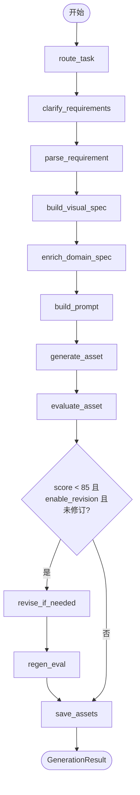

# Agent 工作流规格

## 各 Agent 职责

| Agent | 节点名 | 输入 | 输出 |
|-------|--------|------|------|
| TaskRouterAgent | route_task | GenerationRequest | task_type, route_reason |
| ClarificationAgent | clarify_requirements | user_input, task_type | clarification_questions, clarification_resolved |
| RequirementAgent | parse_requirement | user_input, clarification_resolved | requirement dict |
| VisualSpecAgent | build_visual_spec | requirement, task_type | VisualSpec |
| Domain Agent | enrich_domain_spec | VisualSpec | domain_enrichment |
| PromptAgent | build_prompt | VisualSpec, domain | prompt string |
| AssetManagerAgent | generate_asset | prompt, VisualSpec | output_path |
| CriticAgent | evaluate_asset | VisualSpec, prompt, asset | EvaluationReport |
| RevisionAgent | revise_if_needed | evaluation, prompt | revised prompt |
| AssetManagerAgent | save_assets | all state | prompt/report/trace paths |

## Clarification Agent

`ClarificationAgent` 在路由之后、需求解析之前执行，根据 `task_type` 生成最多 6 道单选题：

- **通用**：style、aspect_ratio、information_density、text_level
- **ecommerce_banner**：platform、marketing_goal、promotion_intensity、compliance_level 等
- **academic_figure**：figure_type、output_format、academic_style、label_language 等
- **ppt_visual**：slide_position、presentation_context、layout_blank、visual_focus 等

每题包含 `default_value`，保证用户不选也能继续生成。`skip_clarification=True` 时全部使用默认值。

Trace metadata 记录：问题列表、默认值、resolved_answers、用户实际选择。

独立 API：`POST /clarify` 仅执行路由 + 出题，供 Streamlit 两步式交互使用。

## LangGraph 状态流

`WorkflowState` 字段：

```
request, task_id, task_type, route_reason,
clarification_questions, clarification_resolved,
requirement, domain_enrichment, visual_spec,
prompt, output_path, evaluation, traces,
report_path, revision_done
```

## 路由逻辑

### TaskRouterAgent 关键词规则

| 任务类型 | 关键词（部分） |
|----------|----------------|
| ecommerce_banner | 商品、促销、电商、主图、618、双11、banner、广告 |
| academic_figure | 论文、方法、模型、流程图、pipeline、architecture |
| ppt_visual | PPT、汇报、报告、封面、presentation、slide |
| 默认 | ppt_visual |

手动指定 `task_type`（非 `auto`）时跳过关键词匹配。

### enrich_domain_spec 分支

```
if task_type == "ecommerce_banner" → EcommerceAgent
elif task_type == "academic_figure" → AcademicFigureAgent
else → PPTVisualAgent
```

### generate_asset 分支

```
if task_type == "academic_figure" → DiagramGenerator (SVG)
else → MockImageGenerator (PNG)
```

## 条件分支



## Trace 规范

每个 Agent 执行后调用 `append_trace()`，记录：

- `step`：节点名称
- `agent_name`：Agent 类名
- `input_summary`：输入摘要（≤120 字）
- `output_summary`：输出摘要
- `metadata`：结构化附加数据
- `timestamp`：ISO 8601 UTC 时间

最终由 `AssetManagerAgent.save_assets` 写入 `storage/traces/{task_id}.json`。

## LLM 扩展

各 Agent 预留 `*_with_llm()` 方法。配置 `.env`：

```
LLM_ENABLED=true
OPENAI_API_KEY=sk-...
```

默认 `LLM_ENABLED=false`，使用规则 + 模板实现。
