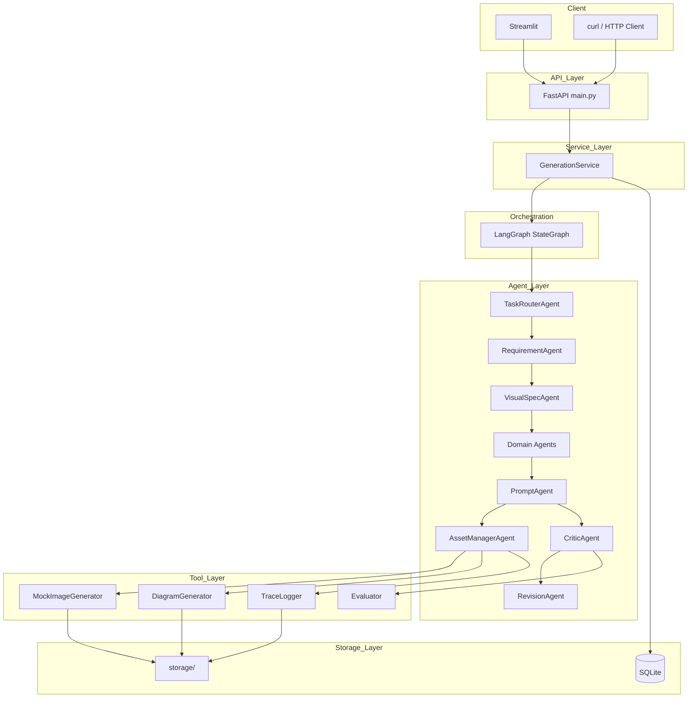

# VisionFlow 架构规格

## 系统分层架构

```
┌─────────────────────────────────────────────┐
│              UI / API 层                     │
│   Streamlit Demo  │  FastAPI REST (main.py) │
├─────────────────────────────────────────────┤
│              服务层 (services/)              │
│         GenerationService                   │
├─────────────────────────────────────────────┤
│           Agent 编排层 (graph/)              │
│         VisionFlowGraph (LangGraph)         │
├─────────────────────────────────────────────┤
│              Agent 层 (agents/)              │
│  Router │ Requirement │ VisualSpec │ ...   │
├─────────────────────────────────────────────┤
│              Tool 层 (tools/)                │
│  Image │ Diagram │ Evaluator │ TraceLogger  │
├─────────────────────────────────────────────┤
│             Storage 层                       │
│   SQLite (tasks)  │  storage/ (files)       │
└─────────────────────────────────────────────┘
```

## Agent 层

| 模块 | 文件 | 说明 |
|------|------|------|
| TaskRouterAgent | `router_agent.py` | 关键词路由 |
| RequirementAgent | `requirement_agent.py` | 需求解析 |
| VisualSpecAgent | `visual_spec_agent.py` | Visual Spec 生成 |
| EcommerceAgent | `ecommerce_agent.py` | 电商领域规则 |
| AcademicFigureAgent | `academic_agent.py` | 学术领域规则 |
| PPTVisualAgent | `ppt_agent.py` | PPT 领域规则 |
| PromptAgent | `prompt_agent.py` | Prompt / Diagram Spec |
| AssetManagerAgent | `asset_manager_agent.py` | 生成与持久化 |
| CriticAgent | `critic_agent.py` | 质量评估 |
| RevisionAgent | `revision_agent.py` | 自动修订 |

## Tool 层

| 模块 | 文件 | 说明 |
|------|------|------|
| MockImageGenerator | `image_generator.py` | PIL 1024×768 占位图 |
| DiagramGenerator | `diagram_generator.py` | SVG 流程图 + Mermaid Spec |
| Evaluator | `evaluator.py` | 五维规则评分 |
| TraceLogger | `trace_logger.py` | AgentTrace JSON 持久化 |
| asset_store | `asset_store.py` | 文件读写工具 |

## Storage 层

| 路径 | 内容 |
|------|------|
| `storage/visionflow.db` | SQLite 任务记录 |
| `storage/generated/` | PNG 占位图 |
| `storage/diagrams/` | SVG 流程图 |
| `storage/prompts/` | Prompt 文本 |
| `storage/reports/` | EvaluationReport JSON |
| `storage/traces/` | AgentTrace JSON |

## UI / API 层

- **FastAPI** (`app/main.py`)：REST 接口，Pydantic 校验
- **Streamlit** (`app/ui/streamlit_app.py`)：交互式 Demo

## 数据流说明

1. 用户通过 Streamlit 或 API 提交 `GenerationRequest`
2. `GenerationService` 创建 `WorkflowState`，调用 `VisionFlowGraph.run()`
3. LangGraph 按序调度各 Agent 节点，每步写入 `AgentTrace`
4. `AssetManagerAgent` 调用 Tool 生成文件，保存 prompt/report/trace
5. 最终状态转换为 `GenerationResult`，写入 SQLite
6. API 返回完整结果；Streamlit 展示各字段

## Mermaid 架构图


